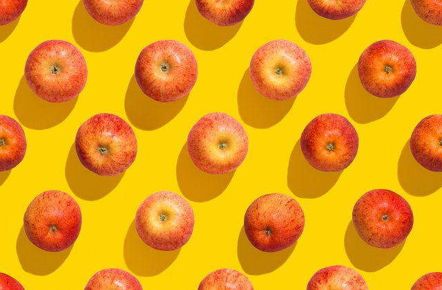
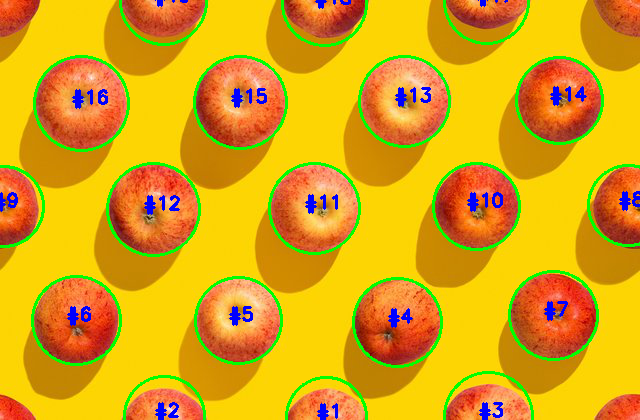

# Streamlit App for Apples Detection

In this repo, you will find an end-to-end computer vision app created using Streamlit. I have created a simple streamlit application by extendeding the code created for my previous [blogpost](https://shrishailsgajbhar.github.io/post/OpenCV-Apple-detection-counting).

TODO:
Add demo video link.

## Requirements

streamlit
opencv-python

## How to run

* Clone the repo and create a python virtual environment
* Install the required packages
* run using `streamlit run app.py`

## Results

### Input image

### Result

